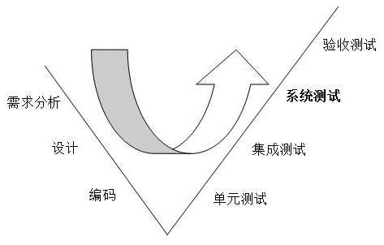

# 20160509单元测试和集成测试业务应用程序--翻译
## 作者钉钉用户名：
########@Li Zhang
## 封面配图：

## 文章摘要:
######主要通过小例子介绍下单元测试 集成测试 测试驱动开发等概念
## 文章正文：
* 单元测试是通过写代码来测试代码的一个小单位测试方式。在一个单元测试中，一次只能测试一个类。例如，如果你正在测试一个使用类File，而另一个测试类DummyFile是用来消除对物理文件系统的需要，单元测试的测试类逻辑应该被测试。为了使class实现从真实到虚/存根之间切换，接口代替真正的类使用。所以，你的类应使用IFile或IDatabase而不是直接使用File和Database。 
* 集成测试，也叫组装测试或联合测试。在单元测试的基础上，将所有模块按照设计要求（如根据结构图）组装成为子系统或系统，进行集成测试。例如：正在测试CunsomerData，它依赖于LINQ to SQL数据库连接，在集成测试中，确保能正常调动所有相关类的方法。
* 测试驱动开发（TDD）是单元测试的极端形式。总的原则是先写单元测试，然后编写实际的代码。例如，先写单元测试，测试CustomerData与在没有真正的代码类CustomerData。该CustomerData类可能包含类似功能InsertCustomer ，DeleteCustomer ， GetCustomer等，它们做的不外乎返回一些虚拟Customer对象，以满足单元测试。 一旦单元测试都与虚拟数据相连，然后你开始写的CustomerData实际代码，它就会访问数据库做真正的处理。编写真正的代码后，单元测试并没有改变测试代码。TDD要求类被设计在没有直接依赖于其他类中。所有的依赖关系通过接口。例如，CustomerData不直接使用SqlConnection，而是使用ISqlConnection ，所有的依赖提供给CustomerData构造。

#### 使用行为驱动开发测试
测试的单一方法用于单个期望是麻烦的。你必须写更多的测试方法来测试每个方法的整体行为。此外，在每个测试方法中，你必须在适当环境下建立测试类，只是为了验证一个特定的期望方式。
例如：给定一个空Stack 当一个项目被压入堆栈和Pop被称为对象然后压入堆栈中的最后一项被返回时，该项目从堆栈中移除，以及任何额外调用Pop都抛出异常。这里定义完整行为的Pop方法。测试这种行为方法的所有预期和相关行为Pop 。

#### 使用BDD单元测试
在第一个例子中，我们将进行单元测试数据访问层。使用LINQ到SQL对象持久化数据访问层交易缓存在实体层面。例如，当你要加载一个用户，它首先检查高速缓存，看看用户是否已经缓存，如果没有，它从数据库中加载用户，然后缓存它。我们来看看PageRepository ，其中所涉及Page实体持久性。共同创建，读取，更新和销毁（CRUD）方法。举一个例子方法GetPageById ，需要一个PageId并加载该Page从数据库中。
```C#
public class PageRepository : IPageRepository
{
    #region Fields
    private readonly IDropthingsDataContext _database;
    private readonly ICache _cacheResolver;
    #endregion Fields

    #region Constructors
    public PageRepository(IDropthingsDataContext database, ICache cacheResolver)
    {
        this._database = database;
        this._cacheResolver = cacheResolver;
    }
    #endregion Constructors

    #region Methods
    public Page GetPageById(int pageId)
    {
        string cacheKey = CacheSetup.CacheKeys.PageId(pageId);
        object cachedPage = _cacheResolver.Get(cacheKey);

        if (null == cachedPage)
        {
            var page = _database.GetSingle<Page, int>(
                   DropthingsDataContext.SubsystemEnum.Page, 
                    pageId, 
                    LinqQueries.CompiledQuery_GetPageById);
            page.Detach();
            _cacheResolver.Add(cacheKey, page);
            return page;
        }
        else
        {
            return cachedPage as Page;
        }
    } 
}
```
PageRepository需要IDropthingsDataContext ，这是测试与LINQ to SQL的一个单位DataContext 。默认情况下，LINQ到SQL不会生成DataContext就是单元测试。你将不得不尝试做一个DataContext单元测试。接着，它需要一个ICache其是与缓存涉及的接口。在这个例子中，假设有一个名为类EnterpriseLibraryCache它将实现ICache 。

测试及预期结果确保：鉴于新PageRepository和一个空的缓存，当 GetPageById是带一个PageId 。它首先检查缓存，如果发现没有，它从数据库中的网页中加载，并返回预期页面。

```C#

public void GetPage_Should_Return_A_Page_from_database_when_cache_is_empty_and_then_caches_it()
{
    var cache = new Mock<ICache>();
    var database = new Mock<IDropthingsDataContext>();
    IPageRepository pageRepository = new PageRepository(database.Object, cache.Object);
    const int pageId = 1;
    var page = default(Page);
    var samplePage = new Page() { ID = pageId, Title = "Test Page", ...};
    database
        .Expect<Page>(d => d.GetSingle<Page, int>(
                              DropthingsDataContext.SubsystemEnum.Page,
                               1, LinqQueries.CompiledQuery_GetPageById))
        .Returns(samplePage);
    "Given PageRepository and empty cache".Context(() =>
        {
            // cache is empty
            cache.Expect(c => c.Get(It.IsAny<string>())).Returns(default(object));
            // It will cache the Page object afte loading from database
            cache.Expect(c =>
                 c.Add(It.Is<string>(cacheKey =>
                       cacheKey == CacheSetup.CacheKeys.PageId(pageId)), 
                      It.Is<Page>(cachePage =>
                          object.ReferenceEquals(cachePage, samplePage))))
                .AtMostOnce().Verifiable();
        });
    "when GetPageById is called".Do(() =>
        page = pageRepository.GetPageById(1));
    "it checks in the cache first and finds nothing and then caches it".Assert(() =>
        cache.VerifyAll());
    "it loads the page from database".Assert(() =>
        database.VerifyAll());
    "it returns the page as expected".Assert(() =>
        {
            Assert.Equal<int>(pageId, page.ID);
        });  
}

```
#### 单元测试的意义何在?
我觉得写单元测试时，所测试的方法不只是在调用测试方法。单元测试已经确切地知道什么其它的类和方法将被调用。在上面的例子中，是否使用cache或database是在方法中决定的，所以，可以进行逻辑测试。例如，我改变了代码来使用AspectF库。这需要代码变更PageRepository 。更改代码后，我需要确保PageRepository还是按照预期的行为。不管我用什么方法的缓存，它不应该改变缓存行为：检查缓存，以确保所请求的对象是不是已经在缓存中，然后从数据库中加载并缓存它。改变方法GetPageById，实施后AspectF ，如下所示：
```c#

public Page GetPageById(int pageId)
{
    return AspectF.Define
        .Cache<Page>(_cacheResolver, CacheSetup.CacheKeys.PageId(pageId))
        .Return<Page>(() =>
            _database.GetSingle<Page, int>(DropthingsDataContext.SubsystemEnum.Page,
                pageId, LinqQueries.CompiledQuery_GetPageById).Detach());
}
```
现在，当我运行单元测试，它表示通过。


它确认行为PageRepository没有改变，尽管它的代码急剧变化。有了正确的单元测试，即使你在代码中改变了，只要你的单元测试全部通过，你的系统是没有问题。接下来让我们来测试，当缓存满了，它正确地从缓存中返回一个对象，而不是不必要的查询数据库。下面的试验将确保：
```c#
[Specification]
public void GetPage_Should_Return_A_Page_from_cache_when_it_is_already_cached()
{
    var cache = new Mock<ICache>();
    var database = new Mock<IDropthingsDataContext>();
    IPageRepository pageRepository = new PageRepository(database.Object, cache.Object);
    const int pageId = 1;
    var page = default(Page);
    var samplePage = new Page() { ID = pageId, Title = "Test Page",
            ColumnCount = 3, LayoutType = 3, UserId = Guid.Empty, VersionNo = 1,
            PageType = Enumerations.PageTypeEnum.PersonalPage,
            CreatedDate = DateTime.Now };
    "Given PageRepository and the requested page in cache".Context(() =>
    {
        cache.Expect(c => c.Get(CacheSetup.CacheKeys.PageId(samplePage.ID)))
            .Returns(samplePage);
    });
    "when GetPageById is called".Do(() =>
        page = pageRepository.GetPageById(1));            
    "it checks in the cache first and finds the object is in cache".Assert(() => 
    {
        cache.VerifyAll();
    });
    "it returns the page as expected".Assert(() =>
    {
        Assert.Equal<int>(pageId, page.ID);
    });
}
```

这个试验是很简单的。唯一的区别是在设置Context ，我们设定一个期望，从缓存请求特定的页面时，它将返回samplePage对象。只要其中任何被调用函数中有没有期望设置，Mock将抛出一个异常。如果代码试图调用任何database对象或任何东西上的其他cache对象时，它会抛出一个异常，从而表明它没有做什么不应该做的。

#### 集成测试使用BDD
集成测试意味着你要测试的一些类，它与其它类和基础设施集成，如数据库，文件系统，邮件服务器等，当你写一个集成测试，测试组件的行为应该是没有任何实物模型。此外，它们提供额外的信心代码工作，因为所有必需的组件和依赖关系也被测试。

如何测试业务外观层，业务外观处理数据访问组件和所有其他实用程序组件的编排。它封装了用户操作为一体的商业运作。例如，在Dropthings ，当第一次全新的用户访问，用户获得创建默认的页面和窗口小部件。这些页面和小部件来自一个模板。有一个名为anon_user@dropthings.com的用户拥有默认的页面和窗口小部件。特定用户的页面和窗口小部件被复制到每一个新用户中。由于这是一个复杂的操作，适合做自动化的集成测试。

当用户首次访问该Default.aspx，该FirstVisitHomePage是呼吁Facade。它通过一个复杂的过程来克隆模板页面、小部件和设置默认用户设置等集成测试，将确保如果FirstVisitHomePage被调用参数标识一个新的用户访问的站点，那么它将返回可以对用户创建的默认页面和部件的一个对象。因此： 由于之前从来没有谁访问过该网站的匿名用户， 当用户第一次访问， 然后在准确的列和位置作为anon_user的网页新创建的页面创建的小部件。
```c#
public class TestUserVisit
{
  public TestUserVisit()
  {
    Facade.BootStrap();
  }
  /// <summary>
  /// Ensure the first visit produces the pages and widgets defined in the template user
  /// </summary>
  [Specification]
  public void First_visit_should_create_same_pages_and_widgets_as_the_template_user()
  {
    MembershipHelper.UsingNewAnonUser((profile) =>
    {
      using (var facade = new Facade(new AppContext(string.Empty, profile.UserName)))
      {
        UserSetup userVisitModel = null;

        // Load the anonymous user pages and widgets
        string anonUserName = facade.GetUserSettingTemplate()
             .AnonUserSettingTemplate.UserName;
        var anonPages = facade.GetPagesOfUser(facade.GetUserGuidFromUserName(anonUserName));

        "Given anonymous user who has never visited the site before"
           .Context(() => { });

        "when the user visits for the first time".Do(() =>
        {
          userVisitModel = facade.FirstVisitHomePage(profile.UserName,
             string.Empty, true, false);
        });

        "it creates widgets on the newly created page at exact columns and
         positions as the anon user's pages".Assert(() =>
        {
          anonPages.Each(anonPage =>
          {
            var userPage = userVisitModel.UserPages.First(page =>
                    page.Title == anonPage.Title
                    && page.OrderNo == anonPage.OrderNo
                    && page.PageType == anonPage.PageType);

            facade.GetColumnsInPage(anonPage.ID).Each(anonColumn =>
            {
              var userColumns = facade.GetColumnsInPage(userPage.ID);
              var userColumn = userColumns.First(column =>
                      column.ColumnNo == anonColumn.ColumnNo);
              var anonColumnWidgets = 
                facade.GetWidgetInstancesInZoneWithWidget(anonColumn.WidgetZoneId);
              var userColumnWidgets = 
                facade.GetWidgetInstancesInZoneWithWidget(userColumn.WidgetZoneId);
              // Ensure the widgets from the anonymous user template's columns are 
              // in the same column and row.
              anonColumnWidgets.Each(anonWidget =>
                 Assert.True(userColumnWidgets.Where(userWidget =>
                  userWidget.Title == anonWidget.Title
                  && userWidget.Expanded == anonWidget.Expanded
                  && userWidget.State == anonWidget.State
                  && userWidget.Resized == anonWidget.Resized
                  && userWidget.Height == anonWidget.Height
                  && userWidget.OrderNo == anonWidget.OrderNo).Count() == 1));
            });
          });
        });
      }
    });
  }
```
需要进一步的解释：为从模板用户发现每个页面确保新用户从模板用户的页面的部件获得完全一样的页面。获得来自新用户的页面的窗口小部件比较每个插件。当在做业务层的变化对于每个插件确保具有相同的名称，状态，位置等独一无二的部件，我可以运行集成测试，以确保关键功能是否按预期工作完成，而且在整个业务层没有破损任何地方。 我用xunit.console.exe上运行的集成测试测试并生成一个不错html报告：


该报告使用下面的命令行产生：
d:\xunit\xunit.console.exe
 d:\trunk\src\Dropthings.Business.Facade.Tests\bin\Debug\Dropthings.Business.Facade.Tests.dll
    /html FacadeTest.html
    
 您可以使用GUI xUnit:
 
 

####使用BDD的单元测试测试驱动开发
到目前为止，我们已经通过代码编写测试，但如果你先代码编写测试有关驱动开发？假设我们要添加行为：给定一个PageRepository ，当 Insert被调用时，它应该在数据库中插入页面，清除了得到的新页面，用户页面任何缓存集合，返回新插入的页面。
编写测试代码：
```c#
[Specification]
public void InsertPage_should_insert_a_page_in_database_and_cache_it()
{
  var cache = new Mock<ICache>();
  var database = new Mock<IDropthingsDataContext>();
  IPageRepository pageRepository = new PageRepository(database.Object, cache.Object);
  const int pageId = 1;

  var page = default(Page);
  var samplePage = new Page() { ID = pageId, Title = "Test Page", ColumnCount = 3, 
    LayoutType = 3, UserId = Guid.NewGuid(), VersionNo = 1, 
    PageType = Enumerations.PageTypeEnum.PersonalPage, CreatedDate = DateTime.Now };

  database
      .Expect<Page>(d => d.Insert<Page>(DropthingsDataContext.SubsystemEnum.Page,
          It.IsAny<Action<Page>>()))
      .Returns(samplePage);

  "Given PageRepository".Context(() =>
  {
    // It will clear items from cache
    cache.Expect(c => c.Remove(CacheSetup.CacheKeys.PagesOfUser(samplePage.UserId)));
  });

  "when Insert is called".Do(() =>
      page = pageRepository.Insert((newPage) =>
      {
        newPage.Title = samplePage.Title;
        newPage.ColumnCount = samplePage.ColumnCount;
        newPage.LayoutType = samplePage.LayoutType;
        newPage.UserId = samplePage.UserId;
        newPage.VersionNo = samplePage.VersionNo;
        newPage.PageType = samplePage.PageType;
      }));

  ("then it should insert the page in database" +
  "and clear any cached collection of pages for the user who gets the new page" +
  "and it returns the newly inserted page").Assert(() =>
  {
    database.VerifyAll();
    cache.VerifyAll();
    Assert.Equal<int>(pageId, page.ID);
  });      
}
```
首先，我们将写一些虚拟代码PageRepository.Insert方法，返回一个新的Page。它应该会fail，因为它不满足目前数据库对象的期望集。如果没有失败，则表明我们的测试是错误的。
```c#

public Page Insert(Action<Page> populate)
        {
                    return new Page();
        } 
```
运行故障测试结果如预期：

TestCase 'Given PageRepository when InsertPage is called, then it should insert the 
page in databaseand clear any cached collection of pages for the user who gets the 
new pageand it returns the newly inserted page'
failed: Moq.MockVerificationException : The following expectations were not met:
IDropthingsDataContext d => d.Insert(Page, null)
    at Moq.Mock`1.VerifyAll()
    PageRepositoryTest.cs(278,0): at 
Dropthings.DataAccess.UnitTest.PageRepositoryTest.<>c__DisplayClass35.
<InsertPage_should_insert_a_page_in_database_and_cache_it>b__34()

这表明，没有呼叫database.Insert ，所以测试失败。我们实现了TDD的第一步，这是写一个测试并使其失败以来的第一期望没有正确组件下检验。
现在添加真正的代码：
```c#
public Page Insert(Action<Page> populate)
       {
           var newPage = _database.Insert<Page>(
               DropthingsDataContext.SubsystemEnum.Page, populate);
           RemoveUserPagesCollection(newPage.UserId);
           return newPage.Detach();
       }
```
现在，当单元测试是对的PageRepository ，它通过新的测试，与以往的测试一起：


#### 使用BDD进行集成测试测试驱动开发
如果我们想为集成测试做TDD？我们如何先写测试代码，然后写它与其他组件集成业务层的代码？ 我们如何为Web层做TDD？方法是一样的，首先你编写测试代码，给出正确的输入，并期望从中活得输出，然而，集成测试不应该只调用单独一个业务操作，以确保它能正常工作。集成测试还应该确保执行其它操作时出现正确的行为。例如，在测试FirstVisitHomePage 时，期望的是，第一次访问之后，用户具有创建的正确页面。测试代码通过检查返回的对象模型验证这一点，但实际情况是，在第一次访问后，根据用户的返回，他们应该看到相同的部件，再次确认第一和复诊返回相同的数据。

测试如下:
```c#
public void Revisit_should_load_the_pages_and_widgets_exactly_the_same()
{
  MembershipHelper.UsingNewAnonUser((profile) =>
  {
    using (var facade = new Facade(new AppContext(string.Empty, profile.UserName)))
    {
      UserSetup userVisitModel = null;
      UserSetup userRevisitModel = null;

      "Given an anonymous user who visited first".Context(() =>
      {
        userVisitModel = facade.FirstVisitHomePage(profile.UserName, ...);
      });

      "when the same user visits again".Do(() =>
      {
        userRevisitModel = facade.RepeatVisitHomePage(profile.UserName, ...);
      });

      "it should load the exact same pages, column and
         widgets as the first visit produced".Assert(() =>
      {
        userVisitModel.UserPages.Each(firstVisitPage =>
        {
          Assert.True(userRevisitModel.UserPages.Exists(page =>
                    page.ID == firstVisitPage.ID));
          var revisitPage = userRevisitModel.UserPages.First(page =>
                     page.ID == firstVisitPage.ID);
          var revisitPageColumns = facade.GetColumnsInPage(revisitPage.ID);
          facade.GetColumnsInPage(firstVisitPage.ID).Each(firstVisitColumn =>
          {
            var revisitColumn = revisitPageColumns.First(column =>
                 column.ID == firstVisitColumn.ID);
            var firstVisitWidgets = facade
               .GetWidgetInstancesInZoneWithWidget(firstVisitColumn.WidgetZoneId);
            var revisitWidgets = facade
               .GetWidgetInstancesInZoneWithWidget(revisitColumn.WidgetZoneId);
            firstVisitWidgets.Each(firstVisitWidget =>
                Assert.True(revisitWidgets.Where(revisitWidget =>
                    revisitWidget.Id == firstVisitWidget.Id).Count() == 1));
          });
        });
      });
    }
  });
}
```
做集成测试的正确方法是编写单元测试的对立面。在单元测试中，这种方法是通过调用一种方法和存根。在集成测试，你应该测试不仅只有一个操作，而且还执行其它相关操作，以确保测试的操作确实是它应该做的。概括了可能的测试用例分为以下类别：
* 当测试创建新数据操作（例如，在数据库中插入行或调用Web服务来创建一个实体），保证了操作通过适当进行：
      调用，通过再次读取该行或调用另一个Web服务，以获得创建的实体读取数据等操作。如果数据没有被正确插入（例如，插入子行）应该失败。 这是一个积极的测试。        
      调用如果插入成功，例如再次插入同一行会产生一个违反约束，将失败的其它操作。这是一种消极的考验。
* 当测试的操作的更新数据（例如，更新数据库中的行），保证了操作的数据，通过适当更新
      调用使用更新后的数据，如果没有正确的更新数据会失败，例如其它的操作使余额不足的账户两次连续的汇款后。这是一个积极的测试。
      如果调用更新成功，将是失败的其它操作，例如尝试使用更新后的相同值约束冲突在数据库中插入新行。这是一种消极的考验。
* 当你测试删除一些数据的操作，保证适当的数据删除
      如果调用数据存在例如重新插入同一行产生一个违反约束将失败，其它的操作。
      呼叫，如果数据被正确地删除，例如插入的子行是不存在的行，将是失败的操作。

在集成测试做正反两方面的测试，即使你正在做单元测试，以确保测试涵盖了系统的所有主要行为是很重要的。集成测试的一个好处是在假设你自己的代码已经单元测试的基础设施不可预测性超过测试自己的代码。重要的是尽可能多的从正和负两方面尽可能覆盖以排除基础设施变量。

## 作者信息：
###### 原文作者：Omar Al Zabir
###### 原文链接：http://www.codeproject.com/Articles/44276/Unit-Testing-and-Integration-Testing-in-Business-A
###### 翻译来与Maxleap团队_云服务研发成员：Sunny Zhang

## 关键词信息：
###### 单元测试 集成测试 测试驱动开发

## 文章分类：
###### 测试开发


